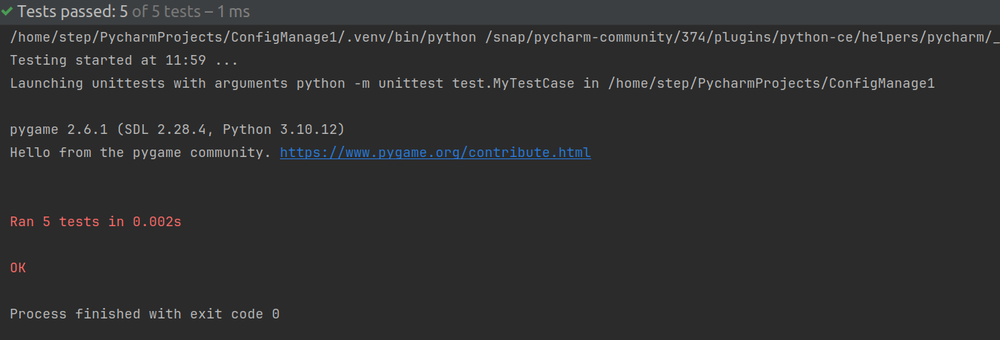
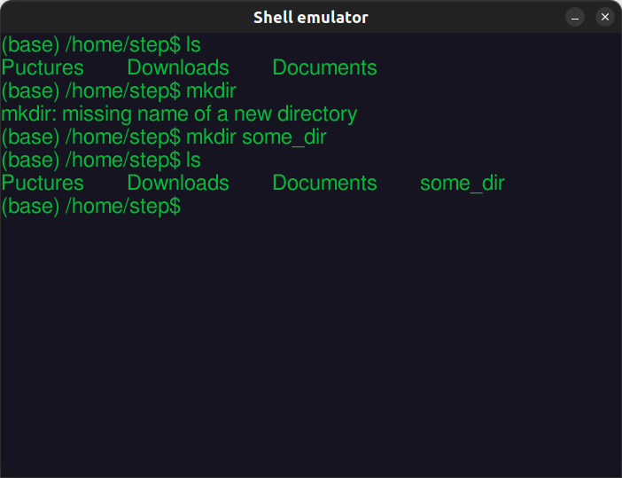
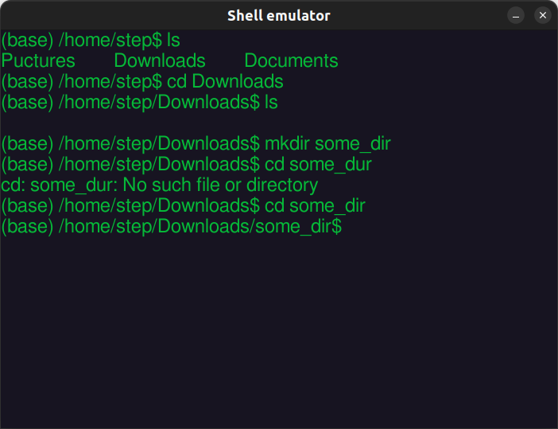
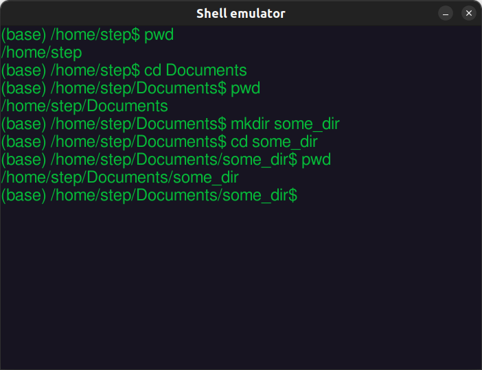

# Эмулятор Shell
## Задание
Разработать эмулятор для языка оболочки ОС. Необходимо сделать работу
эмулятора как можно более похожей на сеанс shell в UNIX-подобной ОС.

Эмулятор должен запускаться из реальной командной строки, а файл с
виртуальной файловой системой не нужно распаковывать у пользователя.

Эмулятор принимает образ виртуальной файловой системы в виде файла формата
tar.  
Эмулятор должен работать в режиме GUI.

Ключами командной строки задаются:  
• Имя компьютера для показа в приглашении к вводу.  
• Путь к архиву виртуальной файловой системы.  
• Путь к лог-файлу.  

Лог-файл имеет формат xml и содержит все действия во время последнего
сеанса работы с эмулятором.

Необходимо поддержать в эмуляторе следующие команды:   
1. ls
2. cd 
3. exit
4. who
5. mkdir

Все функции эмулятора должны быть покрыты тестами, а для каждой из
поддерживаемых команд необходимо написать 2 теста.

## Реализация
Программа была реализована на языке python 
с использованием фреймворка pygame, 
а также модулей tarfile и datetime.

## Тесты
Тестирование команд проведено с помощью модуля unittest. 
Проект содержит модуль test, в котором находятся тесты различных функций программы. 
Программа запускает функцию с исходным набором данных, а затем сравнивает полученные данные с ожидаемыми.
Результаты данного тестирования представлены на рисунке screenshots/unit_tests.png.

Также было проведено тестирование с помощью GUI.  
Результаты данного тестирования представлены на рисунках 
screenshots/test_mkdir.png, screenshots/test_cd.png и screenshots/test_pwd.png

### Результаты тестов

